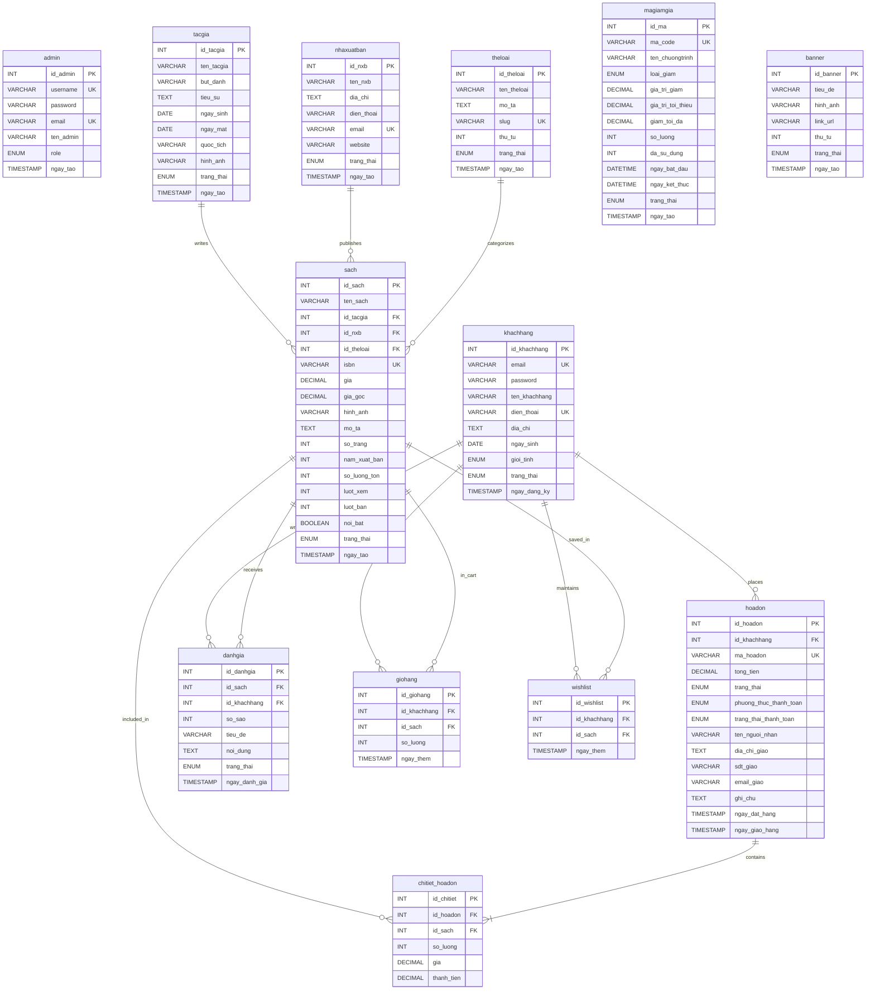

# Database Entity Relationship Diagram (ERD)

## Bookstore Database Schema

This document provides a visual representation of the database structure for the Bookstore E-commerce system.

## Table Descriptions

### Core Entities

#### `admin`
- **Purpose**: Stores admin user accounts with authentication credentials
- **Key Features**: 
  - Username and email uniqueness
  - Role-based access control
  - Password hashing for security
- **Default Admin**: username: `admin`, password: `admin123` (hashed)

#### `khachhang` (Customers)
- **Purpose**: Customer account information and profiles
- **Key Features**:
  - Email and phone uniqueness
  - Account status management (active/inactive/banned)
  - Gender and demographic information
- **Security**: Passwords hashed using `password_hash()`

#### `theloai` (Categories)
- **Purpose**: Book category/genre classification
- **Key Features**:
  - SEO-friendly slug field
  - Display ordering with `thu_tu`
  - Active/inactive status
- **Sample Data**: 10 categories (Văn học Việt Nam, Văn học nước ngoài, Kinh tế, etc.)

#### `tacgia` (Authors)
- **Purpose**: Author information and biography
- **Key Features**:
  - Pen name support (`but_danh`)
  - Birth/death date tracking
  - Nationality and biography
  - Profile image storage
- **Sample Data**: 15+ Vietnamese and international authors

#### `nhaxuatban` (Publishers)
- **Purpose**: Publishing house information
- **Key Features**:
  - Contact information (address, phone, email, website)
  - Email uniqueness validation
  - Active/inactive status
- **Sample Data**: 10 Vietnamese publishers (NXB Trẻ, Kim Đồng, etc.)

#### `sach` (Books)
- **Purpose**: Core book/product information
- **Key Features**:
  - ISBN uniqueness
  - Pricing with original and sale price (`gia_goc`, `gia`)
  - Stock management (`so_luong_ton`)
  - Analytics (views: `luot_xem`, sales: `luot_ban`)
  - Featured book flag (`noi_bat`)
  - Foreign keys to author, publisher, and category
- **Sample Data**: 50+ books across 10 categories

### Transaction Entities

#### `hoadon` (Orders)
- **Purpose**: Customer order/invoice information
- **Key Features**:
  - Unique order code (`ma_hoadon`)
  - Order status tracking (pending, confirmed, shipping, completed, cancelled)
  - Payment method (COD, transfer, MoMo, VNPay)
  - Payment status (paid/unpaid)
  - Shipping information
  - Order and delivery timestamps
- **Business Logic**: Automatically generates unique order code

#### `chitiet_hoadon` (Order Details)
- **Purpose**: Line items for each order
- **Key Features**:
  - Links orders to books
  - Quantity, unit price, and subtotal
  - Historical price preservation (stores price at time of order)
- **Relationships**: Many-to-one to both `hoadon` and `sach`

### Engagement Entities

#### `danhgia` (Reviews)
- **Purpose**: Customer book reviews and ratings
- **Key Features**:
  - 1-5 star rating system (`so_sao`)
  - Review title and content
  - Approval workflow (pending/approved/rejected)
  - Timestamp for review submission
- **Business Logic**: Only approved reviews are displayed publicly

#### `giohang` (Shopping Cart)
- **Purpose**: Temporary storage for items before checkout
- **Key Features**:
  - Quantity management
  - Timestamp for tracking cart age
  - Unique constraint per customer-book pair
- **Business Logic**: Stored procedure `sp_them_vao_gio` handles add/update logic

#### `wishlist` (Wish List)
- **Purpose**: Customer saved/favorite books
- **Key Features**:
  - Simple customer-book relationship
  - Unique constraint per customer-book pair
  - Timestamp for tracking when added
- **Use Case**: Customer can save books for later purchase

#### `magiamgia` (Discount Codes)
- **Purpose**: Promotional discount/coupon management
- **Key Features**:
  - Unique coupon code (`ma_code`)
  - Discount type (percentage or fixed amount)
  - Minimum order value and maximum discount cap
  - Usage tracking (`so_luong`, `da_su_dung`)
  - Validity period (start/end dates)
  - Active/inactive status
- **Sample Data**: NEWYEAR2025, BOOKFEST, FREESHIP, STUDENT10

#### `banner` (Promotional Banners)
- **Purpose**: Homepage slider/banner management
- **Key Features**:
  - Title, image, and link URL
  - Display ordering (`thu_tu`)
  - Active/inactive status
- **Use Case**: Marketing and promotional campaigns

## Relationships

### One-to-Many Relationships

1. **Author → Books** (`tacgia` → `sach`)
   - One author can write many books
   - CASCADE delete: If author deleted, their books are also deleted

2. **Publisher → Books** (`nhaxuatban` → `sach`)
   - One publisher can publish many books
   - CASCADE delete: If publisher deleted, their books are also deleted

3. **Category → Books** (`theloai` → `sach`)
   - One category contains many books
   - CASCADE delete: If category deleted, books in that category are deleted

4. **Customer → Orders** (`khachhang` → `hoadon`)
   - One customer can place many orders
   - CASCADE delete: If customer deleted, their orders are also deleted

5. **Customer → Cart Items** (`khachhang` → `giohang`)
   - One customer has one shopping cart with many items
   - CASCADE delete: If customer deleted, their cart is cleared

6. **Customer → Reviews** (`khachhang` → `danhgia`)
   - One customer can write many reviews
   - CASCADE delete: If customer deleted, their reviews are removed

7. **Customer → Wishlist** (`khachhang` → `wishlist`)
   - One customer has one wishlist with many books
   - CASCADE delete: If customer deleted, their wishlist is cleared

8. **Book → Order Details** (`sach` → `chitiet_hoadon`)
   - One book can appear in many order line items
   - RESTRICT delete: Cannot delete book if it exists in any order

9. **Book → Cart Items** (`sach` → `giohang`)
   - One book can be in many customer carts
   - CASCADE delete: If book deleted, it's removed from all carts

10. **Book → Reviews** (`sach` → `danhgia`)
    - One book can have many reviews
    - CASCADE delete: If book deleted, its reviews are removed

11. **Book → Wishlist** (`sach` → `wishlist`)
    - One book can be in many customer wishlists
    - CASCADE delete: If book deleted, it's removed from all wishlists

### One-to-Many (Composition)

12. **Order → Order Details** (`hoadon` → `chitiet_hoadon`)
    - One order contains many line items
    - CASCADE delete: If order deleted, all its line items are deleted
    - This is a composition relationship (order details cannot exist without an order)

## Database Views

The schema includes 3 reporting views:

### `v_sach_ban_chay` (Best-Selling Books)
- Aggregates book information with sales data
- Includes average rating and review count
- Sorted by `luot_ban` (sales count)

### `v_doanh_thu_thang` (Monthly Revenue)
- Groups revenue by year and month
- Counts orders and unique customers
- Only includes completed and shipping orders

### `v_top_khachhang` (Top Customers)
- Ranks customers by total spending
- Counts number of orders per customer
- Only includes completed orders

## Stored Procedures

### `sp_them_vao_gio` (Add to Cart)
- **Parameters**: customer ID, book ID, quantity
- **Logic**: 
  - If book already in cart, increment quantity
  - If new book, insert new cart item

### `sp_tao_don_hang` (Create Order from Cart)
- **Parameters**: customer ID, shipping info, payment method
- **Output**: order ID and order code
- **Logic**:
  1. Calculate total from cart items
  2. Generate unique order code
  3. Create order record
  4. Copy cart items to order details
  5. Update book stock and sales count
  6. Clear customer's cart
- **Transaction**: All operations wrapped in a transaction

## Triggers

### `tr_cap_nhat_luot_xem` (Update View Count)
- **Event**: AFTER INSERT on `danhgia`
- **Action**: Increment `luot_xem` counter for the reviewed book

### `tr_kiem_tra_ton_kho` (Check Stock Availability)
- **Event**: BEFORE INSERT on `giohang`
- **Action**: Validate that requested quantity does not exceed available stock
- **Error Handling**: Raises SQL error if insufficient stock

## Indexes

Key indexes for performance optimization:

- **Unique Indexes**: email, phone, ISBN, username, order code, coupon code, slug
- **Foreign Key Indexes**: Automatic indexes on all FK columns
- **Search Indexes**: 
  - `idx_khachhang` on `giohang.id_khachhang`
  - `idx_sach` on `giohang.id_sach`
  - Category, author, publisher indexes on `sach`
  - Price range index on `sach.gia`

## Data Types and Constraints

- **Character Set**: UTF8MB4 (supports Vietnamese characters and emojis)
- **Collation**: utf8mb4_unicode_ci
- **Engine**: InnoDB (supports transactions and foreign keys)
- **Timestamps**: Automatic `CURRENT_TIMESTAMP` for creation dates
- **ENUM Fields**: Used for status tracking (order status, payment status, gender, role, etc.)
- **NOT NULL Constraints**: Applied to required fields
- **DEFAULT Values**: Sensible defaults for status fields, counters, and dates

## Sample Data Statistics

The seed data includes:

- **1 Admin Account**: username `admin`, password `admin123`
- **10 Categories**: Various Vietnamese and international book genres
- **15 Authors**: Mix of Vietnamese and international authors
- **10 Publishers**: Vietnamese publishing houses
- **50+ Books**: Across all categories with pricing and stock
- **5 Customers**: Test accounts with password `123456`
- **5 Orders**: Various order statuses for testing
- **7 Reviews**: Approved reviews with 4-5 star ratings
- **6 Cart Items**: Test cart data
- **4 Discount Codes**: Active promotional codes
- **7 Wishlist Items**: Test wishlist data
- **4 Banners**: Active promotional banners

---

**Last Updated**: Generated from `db/bookstore.sql` (600 lines)  
**Database Version**: 1.0  
**Total Tables**: 13 core tables + 3 views
