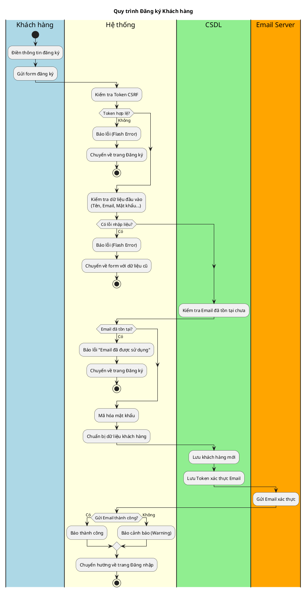
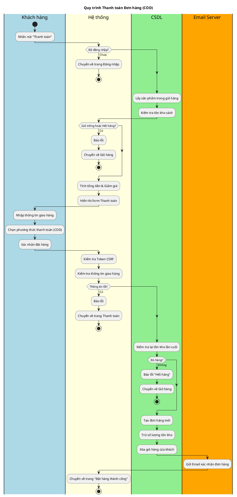
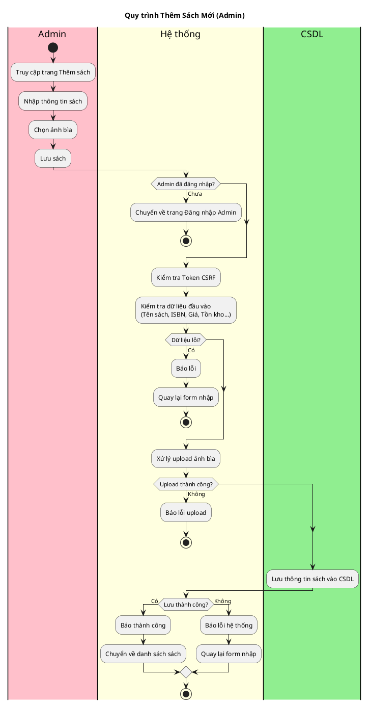
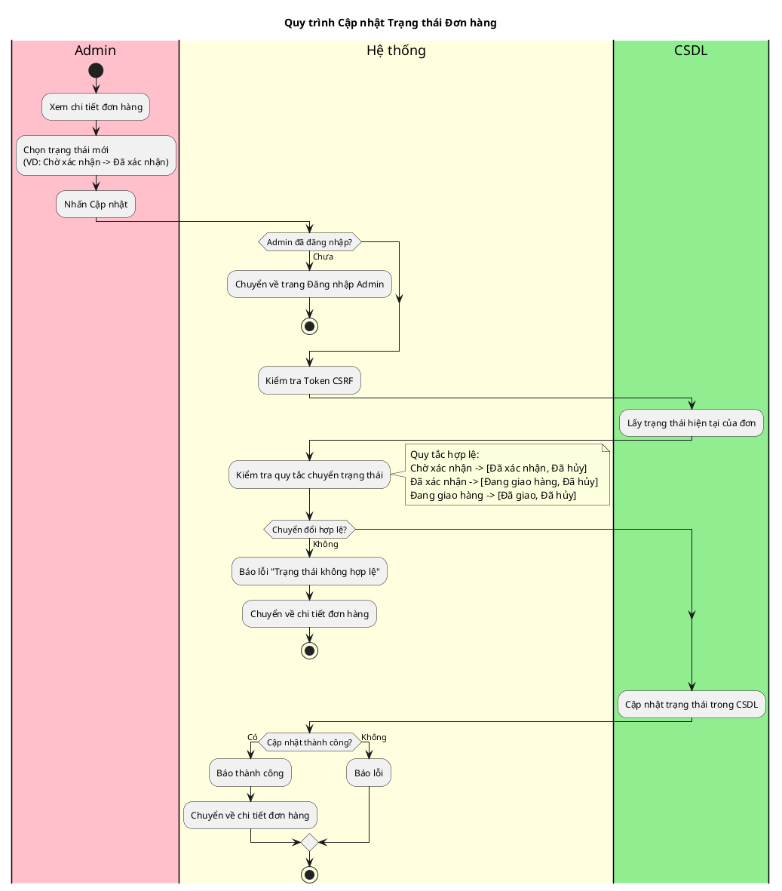

# Biểu đồ hoạt động dự án (Project Activity Diagrams)

Tài liệu này chứa các biểu đồ hoạt động cho các quy trình chính trong dự án "Bookstore".
Bạn có thể hiển thị các biểu đồ này bằng [PlantUML](https://plantuml.com/) hoặc nhập vào Draw.io (Arrange -> Insert -> Advanced -> PlantUML).

## 1. Quy trình Đăng ký Khách hàng
Dựa trên `Controller/RegistrationController.php`.

## 2. Quy trình Thanh toán (COD)
Dựa trên `Controller/OrderController.php`.

## 3. Quy trình Quản lý Sách (Admin)
Dựa trên `Admin/Controller/AdminBookController.php`.

## 4. Quy trình Xử lý Đơn hàng (Admin)
Dựa trên `Admin/Controller/AdminOrderController.php`.

